Project 1
================
Vy Dang
2024-12-07

## The Tennessee STAR Project

A widely studied educational data set is the Tennessee Student/Teacher
Achievement Ratio study. The goal of this study was see the effect of
classroom side (in terms on the number of students per teacher) on
academic achievement. These data are available in the AER package (among
other locations). From the help page for the `STAR` data set:

> Project STAR (Student/Teacher Achievement Ratio) was a four-year
> longitudinal class-size study funded by the Tennessee General Assembly
> and conducted in the late 1980s by the State Department of Education.
> Over 7,000 students in 79 schools were randomly assigned into one of
> three interventions: small class (13 to 17 students per teacher),
> regular class (22 to 25 students per teacher), and regular-with-aide
> class (22 to 25 students with a full-time teacher’s aide). Classroom
> teachers were also randomly assigned to the classes they would teach.
> The interventions were initiated as the students entered school in
> kindergarten and continued through third grade.
>
> The Project STAR public access data set contains data on test scores,
> treatment groups, and student and teacher characteristics for the four
> years of the experiment, from academic year 1985–1986 to academic year
> 1988–1989. The test score data analyzed in this chapter \[of the
> textbook this paragraph comes from\] are the sum of the scores on the
> math and reading portion of the Stanford Achievement Test.

To view the entire help page type the following in the Console:

``` r
?STAR
```

The `STAR` table contains one row for each student who participated in
the program.

``` r
dim(STAR)
```

    ## [1] 11598    47

In this project, I will analyze the STAR data in two parts. In the first part, I will perform Exploratory Data
Analysis on particular variables in the STAR data and interpret my
results. In the second section, I will use particular
programming techniques.

## Part 1: Basic Data Visualization

### Marginal Distributions

Provide plots of the marginal distributions of the following variables
in the STAR data set:

- `gender`

``` r
ggplot(STAR, aes(x = gender)) + geom_bar() + labs(y = "Number of students")
```

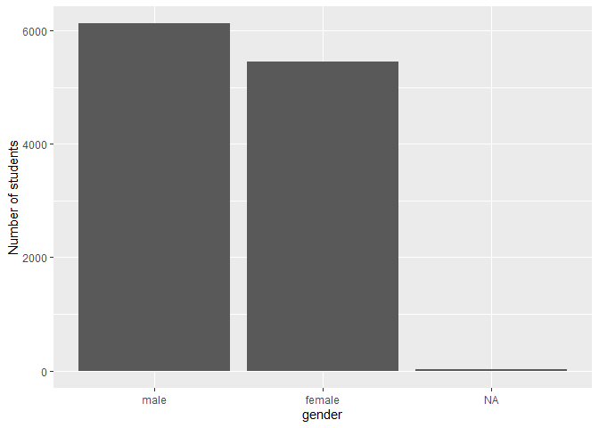

- `stark`

``` r
ggplot(STAR, aes(x = stark)) + geom_bar() + labs(x = "STAR class type in kindergarten",
y = "Number of students")
```

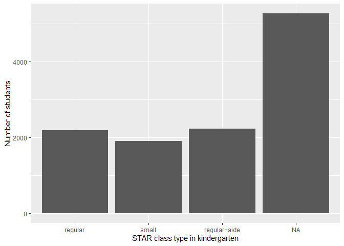

- `readk`

``` r
ggplot(STAR, aes(x = readk)) + geom_bar() +
labs(x = "Total reading scaled score in kindergarten",
y = "Number of students")
```

    ## Warning: Removed 5809 rows containing non-finite values (`stat_count()`).

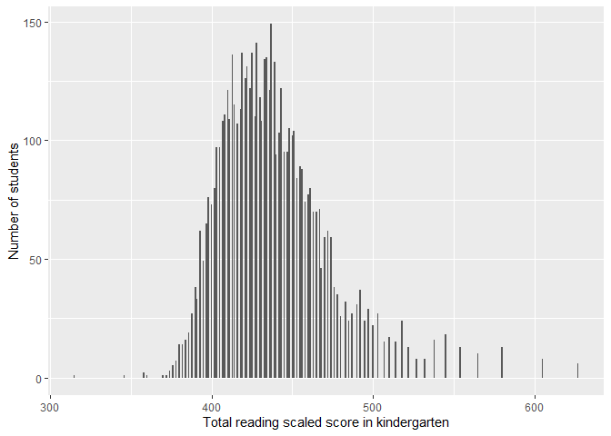

- `mathk`

``` r
ggplot(STAR, aes(x = mathk)) + geom_bar(width = 2) +
labs(x = "Total math scaled score in kindergarten",
y = "Number of students")
```

    ## Warning: Removed 5727 rows containing non-finite values (`stat_count()`).

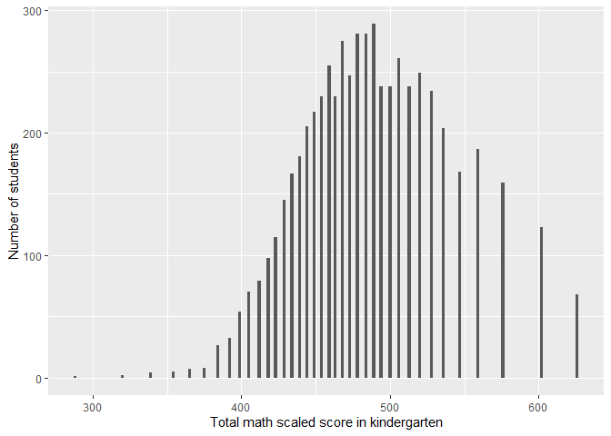

- `experiencek`

``` r
ggplot(STAR, aes(x = experiencek)) + geom_bar(width = 0.5) +
labs(x = "Years of teaching experience among kindergarten teachers",
y = "Number of teachers")
```

    ## Warning: Removed 5294 rows containing non-finite values (`stat_count()`).

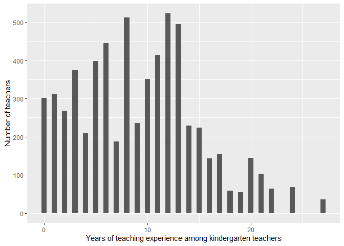

For each variable, look up the description of the variable in the `STAR`
help page and use to give a better label to the scale for the variable.

#### Interpreation of results

Write a brief paragraph about what you observe in these plots. What
questions would identify for further study based on your plots?

• Gender: There are more male students in the STAR dataset than female
students. 

• STAR kindergarten class type (stark): Fewer kindergarten
students are assigned to the STARsmall class size, while the number of
students assigned to STAR regular and regular-with-aide class type are
higher and roughly the same. A lot of students weren’t assigned to any
STAR class type. 

• Reading score (readk): Most kindergarten students
scored around 420 to 470 for the readingscores. 

• Math score (mathk): Most kindergarten students scored around 470 to 560 for the math scores.

• Teaching experience (experiencek): There’s a trend towards newer to
12-year-teachers, with fewer teachers of 15-30 years of teaching
experience. 

From the plots, several questions could arise for further
study, including: 

• How do math and reading scores correlate with each
other? (Bivariate analysis.) 

• Does gender correlate with math or
reading scores, and if so, how? 

• How does teacher experience affect
student achievement in math and reading scores? 

• Are there any
significant differences in student achievement across different STAR
class types?

### Joint and Conditional Distributions

Provide plots of either joint distributions or conditional distributions
as appropriate for the following pairs of variables in the STAR data
set:

- `gender` and `stark`

``` r
ggplot(STAR, aes(x = stark, fill = gender)) + geom_bar()
```

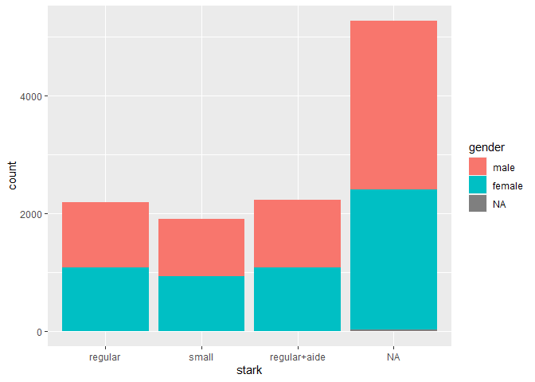

- `readk` and `read1`

``` r
ggplot(STAR, aes(x = readk, y = read1)) + geom_point() + geom_smooth(stat = "smooth")
```

    ## `geom_smooth()` using method = 'gam' and formula = 'y ~ s(x, bs = "cs")'

    ## Warning: Removed 7587 rows containing non-finite values (`stat_smooth()`).

    ## Warning: Removed 7587 rows containing missing values (`geom_point()`).

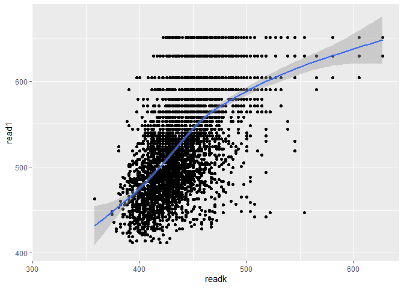

- Sum the `readk` and `mathk` and `stark`

``` r
stark_sum <- STAR |> mutate(sum_readk_mathk = readk + mathk)
ggplot(stark_sum, aes(x = stark, y = sum_readk_mathk)) + geom_point()
```

    ## Warning: Removed 5812 rows containing missing values (`geom_point()`).

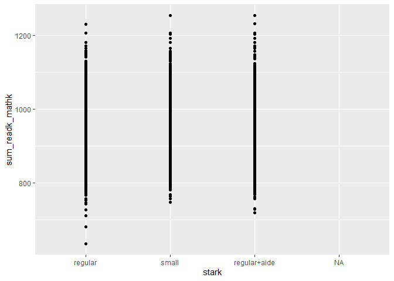

- Using a facet plot, repeat the previous plot also adding `experiencek`

``` r
ggplot(stark_sum, aes(x = stark, y = sum_readk_mathk)) + geom_point() + facet_wrap(~experiencek) +
theme(axis.text.x = element_text(angle = 45, hjust = 1))
```

    ## Warning: Removed 5812 rows containing missing values (`geom_point()`).

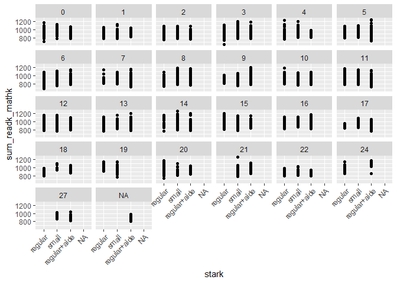

#### Interpretation of results

Write a brief paragraph about what you observe in these plots. What do
we learn from these plots? Why would the 3 and 4 plot be particularly
important for the people fielding this study (based on the quoted
paragraphs above)?

Plot 1 may reveal whether certain class types have a gender imbalance,
which could be crucial for understanding social dynamics within the
classroom that might impact learning. Here, the proportion of male and
female students in each class types are the same in all class types.

Plot 2 might indicate a correlation (or its absence) between early
reading skills in kindergarten and those in the first grade, hinting at
the persistence (or change) in reading abilities as students advance.

Plot 3 could illuminate if the class type is associated with variations
in total academic achievement in kindergarten. Here, the small class
type students tend to consistently perform in the upper range, and with
the smaller spread of scores compared to the other 2 class types.

Plot 4, by including experiencek, helps us explore an extra layer:
whether teacher experience influences total student achievement within
each class type.

Plots 3 and 4 are of particular importance as they explore the combined
effect of reading and math skills, which together offer a broader gauge
of students’ academic performance early on. Plot 4’s addition of teacher
experience adds depth by considering how this environmental factor might
influence students’ combined achievement. Such insights would be
essential for researchers and educators as they aim to tailor
educational interventions and understand the impact of different
classroom settings. It might prompt further exploration, such as whether
specific interventions could mitigate any negative effects seen or
highlight the most effective environments for student learning.

### Numerical Summaries

Using tools we have discussed for computing numerical summaries, compute
the following:

- The proportion of students in each type of STAR class in kindergarten
  (`stark`).

``` r
STAR |> group_by(stark)|> count() |> ungroup() |> mutate(STAR_proportion = n/sum(n))
```

    ## # A tibble: 4 × 3
    ##   stark            n STAR_proportion
    ##   <fct>        <int>           <dbl>
    ## 1 regular       2194           0.189
    ## 2 small         1900           0.164
    ## 3 regular+aide  2231           0.192
    ## 4 <NA>          5273           0.455

- The number of each `gender` in within `stark` class type.

``` r
STAR |> group_by(stark)|> count(gender)
```

    ## # A tibble: 9 × 3
    ## # Groups:   stark [4]
    ##   stark        gender     n
    ##   <fct>        <fct>  <int>
    ## 1 regular      male    1119
    ## 2 regular      female  1075
    ## 3 small        male     977
    ## 4 small        female   923
    ## 5 regular+aide male    1154
    ## 6 regular+aide female  1077
    ## 7 <NA>         male    2872
    ## 8 <NA>         female  2381
    ## 9 <NA>         <NA>      20

- Compute the median reading and math scores in kindergarten for
  students in each type of STAR class.

``` r
STAR |> group_by(stark)|> summarize(med_readk = median(readk, na.rm = TRUE),
med_mathk = median(mathk, na.rm = TRUE)) |>
arrange(desc(med_readk))
```

    ## # A tibble: 4 × 3
    ##   stark        med_readk med_mathk
    ##   <fct>            <dbl>     <dbl>
    ## 1 small              436       484
    ## 2 regular            431       478
    ## 3 regular+aide       430       478
    ## 4 <NA>                NA        NA

- Repeat the previous computation also grouping by `experiencek`.

``` r
STAR |> group_by(stark, experiencek) |> summarize(med_readk = median(readk, na.rm = TRUE),
med_mathk = median(mathk, na.rm = TRUE)) |>
arrange(desc(med_mathk))
```

    ## `summarise()` has grouped output by 'stark'. You can override using the
    ## `.groups` argument.

    ## # A tibble: 73 × 4
    ## # Groups:   stark [4]
    ##    stark        experiencek med_readk med_mathk
    ##    <fct>              <int>     <dbl>     <dbl>
    ##  1 regular+aide          24      498.       589
    ##  2 regular               19      465        528
    ##  3 regular               24      436        520
    ##  4 small                 18      462        520
    ##  5 regular+aide          18      460        520
    ##  6 small                  4      456        513
    ##  7 regular               20      448.       506
    ##  8 small                 14      456        506
    ##  9 small                 16      467        503
    ## 10 regular               16      445        500
    ## # ℹ 63 more rows

- Create a column that shows the difference in `math1` and `mathk` for
  each student. Compute the mean difference for students in each type of
  `stark` class.

``` r
STAR |> mutate(math_1_k_dif = math1 - mathk) |> group_by(stark) |>
summarize(avg_math_1_k_dif = mean(math_1_k_dif, na.rm = TRUE))
```

    ## # A tibble: 4 × 2
    ##   stark        avg_math_1_k_dif
    ##   <fct>                   <dbl>
    ## 1 regular                  42.6
    ## 2 small                    44.2
    ## 3 regular+aide             42.8
    ## 4 <NA>                    NaN

- Within each type of STAR class, subtract the median `mathk` score from
  each student’s score. Compute the mean centered-math-score for each
  level of `experiencek`.

``` r
STAR |> group_by(stark) |> mutate(med_mathk_centered = mathk - median(mathk, na.rm = TRUE)) |>
group_by(experiencek) |>
summarize(avg_med_mathk_centered = mean(med_mathk_centered))
```

    ## # A tibble: 26 × 2
    ##    experiencek avg_med_mathk_centered
    ##          <int>                  <dbl>
    ##  1           0                     NA
    ##  2           1                     NA
    ##  3           2                     NA
    ##  4           3                     NA
    ##  5           4                     NA
    ##  6           5                     NA
    ##  7           6                     NA
    ##  8           7                     NA
    ##  9           8                     NA
    ## 10           9                     NA
    ## # ℹ 16 more rows

#### Interpretation

Write a brief paragraph about what you observe in these numerical
summaries. Again, think about what information the study creators wanted
to ask and how these computations are useful to explore the data in
light of those considerations.

The proportions of students in each type of STAR class: Fewer students
are assigned to the small class types (16%) than regular or
regular-with-aide class (~19%).

The gender counts within class types: Overall, there are more male
students in each class types.

The median reading and math scores by class type: Median math and
reading score for small class type are highest among all 3 class types.

Teacher’s experience level: The highest median scores are for the
teachers with relatively higher years of experience.

The change in math scores from kindergarten to first grade: The small
class type might suggest the most effectiveness in promoting math skills
development over time.

By centering math scores around the class median, one can examine
whether all students benefit similarly from their classroom type or if
some subgroups (e.g., distinguished by experiencek) benefit more.

## Part 2: Additional Activities

In this section, you will be directed to use specific tools, but you may
apply them to the data set as you see fit. In each section, write a
brief explanation of how you are using the tool.

### Table Operations

#### `group_by`, `summarize`, and `mutate`

Use `group_by`, `summarize`, and `mutate` to modify and summarize the
data in ways not performed in the previous section. Perform three
separate applications of these tools. Write a paragraph explaining your
intent and what you learn from the results of the computations.

``` r
# 3rd grade total average math and reading scaled score based on school type
STAR |> group_by(school3) |> summarize(avg_math3 = mean(math3, na.rm = TRUE),
avg_read3 = mean(read3, na.rm = TRUE)) |>
mutate(total_avg_math3_read3 = avg_math3 + avg_read3) |>
arrange(desc(total_avg_math3_read3))
```

    ## # A tibble: 5 × 4
    ##   school3    avg_math3 avg_read3 total_avg_math3_read3
    ##   <fct>          <dbl>     <dbl>                 <dbl>
    ## 1 rural           625.      622.                 1247.
    ## 2 urban           620.      618.                 1238.
    ## 3 suburban        618.      617.                 1235.
    ## 4 inner-city      601.      597.                 1198.
    ## 5 <NA>            NaN       NaN                   NaN

``` r
# Grade 2 Pass Rate by Teacher's experience level
STAR |> group_by(experience2) |> summarize(pass_rate_math2 = sum(math2 >= 400, na.rm = TRUE)/n(),
pass_rate_read2 = sum(read2 >= 400, na.rm = TRUE)/n())
```

    ## # A tibble: 39 × 3
    ##    experience2 pass_rate_math2 pass_rate_read2
    ##          <int>           <dbl>           <dbl>
    ##  1           0           0.910           0.910
    ##  2           1           0.937           0.937
    ##  3           2           0.826           0.824
    ##  4           3           0.929           0.929
    ##  5           4           0.897           0.885
    ##  6           5           0.931           0.943
    ##  7           6           0.904           0.894
    ##  8           7           0.907           0.913
    ##  9           8           0.910           0.918
    ## 10           9           0.921           0.921
    ## # ℹ 29 more rows

``` r
# 3rd grade teachers' highest degree count by ethnicity
STAR |> group_by(tethnicity3, degree3) |> summarize(degree_count = n())
```

    ## `summarise()` has grouped output by 'tethnicity3'. You can override using the
    ## `.groups` argument.

    ## # A tibble: 8 × 3
    ## # Groups:   tethnicity3 [4]
    ##   tethnicity3 degree3    degree_count
    ##   <fct>       <fct>             <int>
    ## 1 cauc        bachelor           3042
    ## 2 cauc        master             2182
    ## 3 cauc        specialist           89
    ## 4 cauc        <NA>                 15
    ## 5 afam        bachelor            720
    ## 6 afam        master              689
    ## 7 asian       master               14
    ## 8 <NA>        <NA>               4847

3rd Grade Total Average Math and Reading Scaled Score Based on School
Type: The intent here is to calculate the total average math and reading
scores for 3rd grade students, grouped by school type. From the results,
schools in rural are, on average, perform better in 3rd grade academic
achievement across math and reading, while schools in inner city perform
worse. Of course, there are many more factors account for the scores
(school system, teacher experience, etc) in the dataset.

Grade 2 Pass Rate by Teacher’s Experience Level: This operation aims to
determine the pass rates for math and reading in Grade 2, categorized by
the teacher’s experience level. Overall the pass rate is relatively high
for STAR class students, while students not in STAR classes seem to have
a lower pass rate.

3rd Grade Teachers’ Highest Degree Count by Ethnicity: This code is used
to tally the count of 3rd grade teachers’ highest degrees, broken down
by the teachers’ ethnicities and the degree held. This information could
help in understanding the diversity of educational backgrounds among
teachers, as well as any trends or disparities in educational attainment
across different ethnic groups. Overall, most teachers are Caucasian
with a bachelor degree and the highest degree for this ethnicity is
specialist. Bachelor degree is the most common degree among 3rd grade
STAR teachers.

#### `filter` and `select`

Use the `filter` and `select` functions to drill down into interesting
subsets of the data. You may use `across(everything(), ...)` in a
`mutate` or `summarize` as a reason for selecting particular columns.
Write a paragraph explaining your goals and how you can use these
functions to achieve them.

``` r
# Grade 3 highest math and reading scaled score by ethnicity
STAR |>
mutate(across(c(math3, read3), ~ .x > 600, .names = "high_{.col}")) |>
select(ethnicity, high_math3, high_read3) |> filter(high_math3 == "TRUE",
high_read3 == "TRUE") |>
count(ethnicity)
```

    ##   ethnicity    n
    ## 1      cauc 2502
    ## 2      afam  719
    ## 3     asian   12
    ## 4  hispanic    4
    ## 5     other    6
    ## 6      <NA>    6

The goal of this code is to identify students within the STAR dataset
who have achieved a high scaled score (defined as over 600) in both math
and reading in Grade 3 and to examine the distribution of these
high-achieving students across different ethnicities. The goal is to
prompt further questions about educational equity, the effectiveness of
interventions, and the distribution of resources across different
groups. By using these functions, the analysis narrows down to a subset
of the data that is of particular interest—high-performing Grade 3
students in both math and reading—and categorizes them by ethnicity.
This subset can reveal if certain ethnic groups are overrepresented or
underrepresented among high achievers. The result of this computation
would provide a count of students by ethnicity who are excelling in both
subjects.

### Custom Functions

#### Avoid repetition

Look over the previous sections of this project and identify repetitive
or similar code that could replaced with a function. You may use
optional arguments or the `...` argument, but they are not required.

Explain your function’s usage and demonstrate it on the STAR data.

``` r
group_by_column <- function(STAR, column){
grouped_STAR <- STAR |> group_by({{column}})
grouped_STAR
}
```

``` r
# Demonstrate group_by_column function
group_by_column(STAR, schoolk) |> summarize(avg_readk = mean(readk, na.rm = TRUE))
```

    ## # A tibble: 5 × 2
    ##   schoolk    avg_readk
    ##   <fct>          <dbl>
    ## 1 inner-city      428.
    ## 2 suburban        442.
    ## 3 rural           438.
    ## 4 urban           441.
    ## 5 <NA>            NaN

``` r
group_by_column(STAR, degreek) |> count(experiencek)
```

    ## # A tibble: 53 × 3
    ## # Groups:   degreek [5]
    ##    degreek  experiencek     n
    ##    <fct>          <int> <int>
    ##  1 bachelor           0   302
    ##  2 bachelor           1   312
    ##  3 bachelor           2   268
    ##  4 bachelor           3   328
    ##  5 bachelor           4   135
    ##  6 bachelor           5   292
    ##  7 bachelor           6   260
    ##  8 bachelor           7   104
    ##  9 bachelor           8   223
    ## 10 bachelor           9   180
    ## # ℹ 43 more rows

The purpose of the group_by_column function is to reduce the amount of
repetitive code written when performing grouping operations in various
analyses. This function takes in two arguments: the STAR data frame, and
a column by which to group the data. By using the curly curly ({{ }})
syntax, the function is able to take unquoted column names and evaluate
them in the context of the data frame, making it versatile for different
grouping scenarios.

#### Predicate functions

Identify some feature of the the columns in the STAR table that can be
either true or false. Write a predicate function to identify these
columns and applying it using the `select` function. Summarize the
result and explain why it was useful. You may find it helpful to use
`filter` first to restrict your attention to a particular subset of the
data.

``` r
is_integer <- function(STAR, column) {
column_data <- na.omit(STAR[[column]])
if (is.numeric(column_data) && all(floor(column_data) == column_data)) {
return(TRUE)
} else {
return(FALSE)
}
}
```

``` r
# Demonstrate is_na function: Check if a column contains only integers and
# create a data frame contains only integer columns
STAR <- na.omit(STAR)
is_integer(STAR, "math2")
```

    ## [1] TRUE

``` r
## [1] TRUE
integer_columns <- select(STAR, which(sapply(names(STAR),
function(column) is_integer(STAR, column))))
```

The purpose of the is_integer function is to check whether a given
column in a data frame contains only integer values. The results of the
code demonstration are only columns with integer values. This can be
useful for several reasons, such as certain statistical analyses might
require integer inputs, or to ensure that variables which are supposed
to be integers (like counts) are indeed coded properly in the dataset.
Sometimes integer columns also need to be converted to factors or other
types for analysis or visualization, so this will make the data
processing process easier.

### Advanced ggplot

Create one or plots that make use of the following advanced ggplot
features. Across your plots, use each feature at least once.

- coordinate systems
- added `stat_*` layers or alternate `stat` arguments for a `geom_*`
  functions
- `facet_grid`

Write a paragraph interpreting your plots.

``` r
STAR <- na.omit(STAR)
ggplot(STAR, aes(x=school3)) + geom_bar() + coord_flip() + labs(x= "Number of schools",
y = "School type in 3rd grade")
```

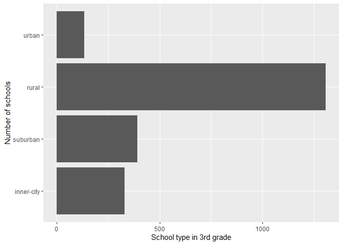

``` r
ggplot(STAR, aes(x=school3, y=math3)) + stat_summary(fun = mean) +
labs(x = "3rd grade school type",
y = "Average math scaled score in 3rd grade")
```

    ## Warning: Removed 4 rows containing missing values (`geom_segment()`).

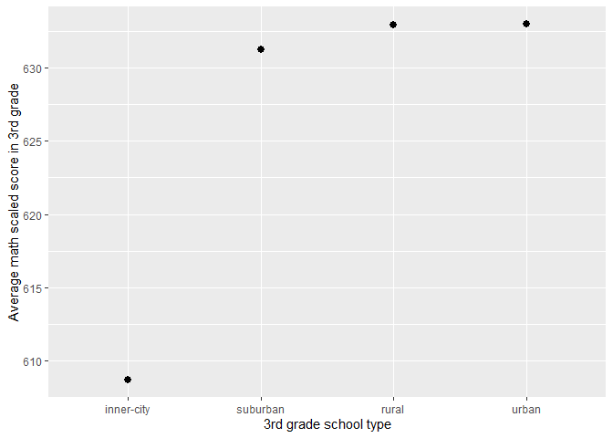

``` r
ggplot(STAR, aes(x = readk, y = mathk)) + geom_bin_2d() + facet_grid(schoolk ~ ethnicity) +
labs(x= "Total reading scaled score in kindergarten",
y = "Total math scaled score in kindergarten") +
ggtitle("Total math and reading scaled score in kindergarten by school type and ethnicity") +
theme(plot.title = element_text(hjust = 0.5))
```

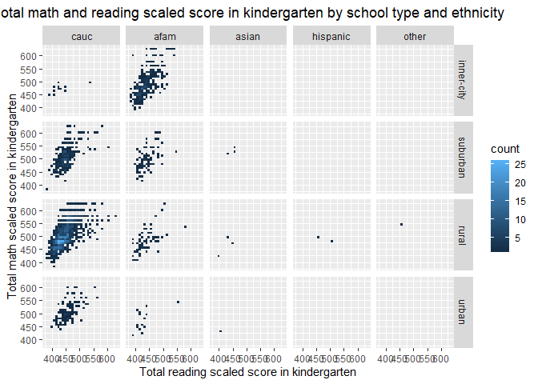


Plot 1 is especially useful when there are many categories or when category names
are lengthy. Since geom_bar() by default counts the frequency of each
category, we would interpret this plot as showing the number of schools
in each type of school category in the third grade. Here, we can see
there are significantly more rural schools for 3rd grade than other
school types.

Plot 2 would provide a quick comparison of the average math achievement
across school types. Here, we see the average scores for suburban,
rural, and urban schools are significantly higher than the scores for
inner city schools.

Plot 3 looks at the relationship between the total reading and math
scaled scores from kindergarten cross-tabulated by school type and
ethnicity. We are simultaneously comparing the performance across
different school types and ethnic backgrounds. In this plot, we can see
that most students for the STAR project are Caucasian and African
American. We can also see that the ethnicity and school types may
correlate to each other. For example, there’s no hispanic student in
suburban kindergarten or no asian and hispanic student in inner city
kindergarten. Overall, the trend is that as the reading scores increase,
the math scores also increase.

## Part 3: Conclusion

Write two to three concluding paragraphs about what you have learned
about the Tennessee STAR study and the effect of different classroom
sizes on student achievement. Use markdown to make the formatting of
your conclusion easy to read. Use the features of R chunks and inline R
to include calculations without burdening the reader with understanding
R code.

Based on the findings I have analyzed from the Tennessee STAR study, we
have observed significant evidence indicating that smaller classroom
sizes have a positive impact on student achievement, particularly in the
early grades. The study was a large, multi-year, randomized experiment
conducted in Tennessee from 1985 to 1989 and provided rich data for
assessing the effects of small classes on learning. The initial analysis
showed that students in small classes (13-17 students) tend to
outperform their peers in larger classes (22-26 students) in reading and
math standardized tests.

The dataset reveals that kindergarteners in small class types
consistently exhibit superior performance, with the smallest range of
scores pointing towards a potentially more uniform level of instruction
or student engagement. Additionally, a greater number of male students
present across all class types raises questions regarding gender
dynamics and their impact on the learning environment. While the
proportions of students in small classes are smaller, the data suggest
that students in these smaller environments benefit more significantly,
as evidenced by higher median reading and math scores. Furthermore, this
effect is magnified when considering the influence of teaching
experience, with students taught by more seasoned educators exhibiting
even better academic outcomes.

Moreover, the development of math skills from kindergarten to first
grade implies that the smallest class settings may promote more
effective and persistent academic growth, particularly in math. Plot
analyses also highlight the social dimensions and biases within the
educational contexts, such as the distribution of schools by type and
the correlation of achievement with both ethnicity and school types. It
is crucial to note that disparities exist, with Caucasian and African
American students representing the majority within the STAR project, and
significant differences arising in math achievement between suburban,
rural, urban, and inner-city schools.
